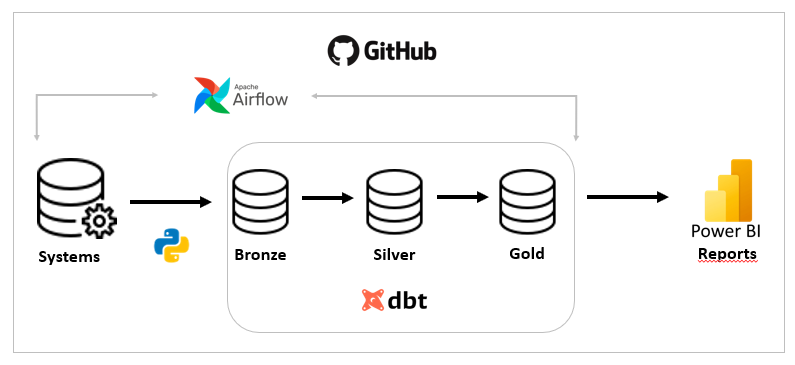
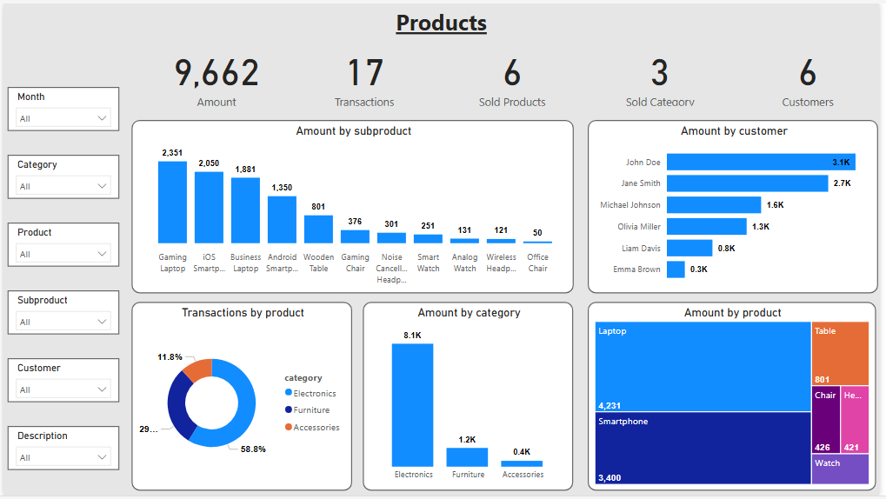

# dbt-transactions
dbt architecture to create transactions dashboard.
# dbt-transactions

This is the architecture to create the product dashboard:




# link -> https://shorturl.at/yltUt


1. Clone the repository:
```bash
git clone https://github.com/aguiarpaulo/dbt-transactions.git

cd dbt-transactions
```
2. Configure the correct Python version with pyenv:
```bash
pyenv install 3.11.3
pyenv local 3.11.3
```
3. Activate the virtual environment:
```bash
python -m venv .venv
source .venv/Scripts/activate
```
4. Install project dependencies:
```bash
pip install -r requirements.txt 
```
5. Run the pipeline run command to perform ETL:
```bash
airflow -> astro dev (start or restart)
dbt -> dbt run
```
Contact:
Paulo Aguiar - aguiarlapaulo@gmail.com